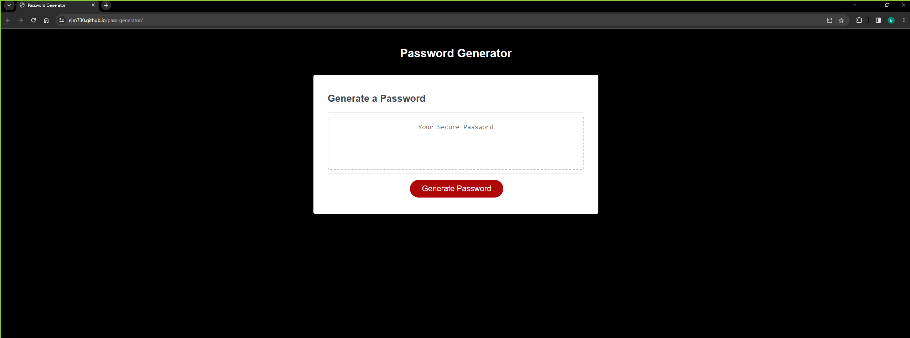

# Password Generator

## Description

I created this application to help create secure passwords for anyone that wants to use this tool. It helps create a secure password by asking whether the user wants to include different characters either upper or lowercase, digits as well as special characters. Since JavaScript was the main focus in this excercise it helped me learn and understand the different functions and how they work to make a webpage more dynamic by creating JavaScript code instead of modifying HTML or CSS.

## Installation

This application does not need to be downloaded on its own, you can access it by visiting the webpage @ <https://ejm730.github.io/pass-generator/> .

## Usage

To use the password generator properly you will need to hit the "Generate Password" button for the prompts to show up at the top of the page. The prompts can either be agreed to by clicking "ok" or skipped by hitting the "cancel" button on the prompts you do not which to include.

## License

Please refer to README.md in repository
